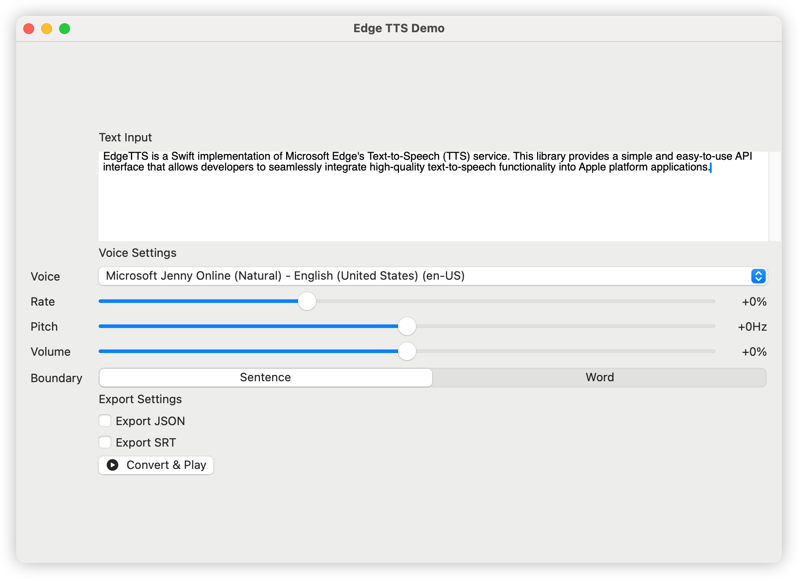

# Edge-TTS

<p align="center">

</p>

Edge-TTS is a Swift implementation of Microsoft Edge's Text-to-Speech (TTS) service. This library provides a simple and easy-to-use API interface that allows developers to seamlessly integrate high-quality text-to-speech functionality into Apple platform applications.

[日本語ドキュメント](README_JP.md) | [中文文档](README_CN.md) | [한국어 문서](README_KR.md)

## Features

### Multiple Voices and Languages

- Over 400 neural network voices
- Support for 100+ languages and regional variants
- Natural speech synthesis effect

### Flexible Voice Control

- Adjustable speech rate (-50% to +100%)
- Pitch control (-50Hz to +50Hz)
- Volume control (-50% to +50%)
- Boundary type selection (sentence/word)

### Rich Output Options

- Support for MP3 format export
- Real-time speech synthesis streaming
- Asynchronous conversion and playback
- Optional JSON metadata export
- Optional SRT subtitle export
- Cross-platform file export support (iOS/macOS)

### Development Tools

- Command-line tool for quick testing and batch processing
- Native GUI application with visual configuration
- Detailed API documentation and usage examples

### Cross-Platform Compatibility

- macOS 13.0+
- iOS/iPadOS 15.0+

## Installation

### Swift Package Manager

Add the following dependency to your Package.swift file:

```swift
dependencies: [
    .package(url: "https://github.com/brewusinc/edge-tts.git", from: "1.0.0")
]
```

## Quick Start

### Basic Usage

```swift
import EdgeTTS

// Create TTS instance
let tts = EdgeTTS(config: Configure(
    voice: "en-US-JennyNeural",
    rate: "+0%",
    pitch: "+0Hz",
    volume: "+0%",
    saveJSON: true,  // Enable JSON metadata export
    saveSRT: true,   // Enable SRT subtitle export
    boundaryType: .sentence  // Use sentence boundary (.word for word boundary)
))

// Async conversion
Task {
    do {
        try await tts.ttsPromise(text: "Hello, World!", audioPath: "output.mp3")
        print("Conversion completed")
    } catch {
        print("Conversion failed: \(error)")
    }
}
```

### Command Line Tool Usage

The CLI tool provides two main commands: `list` and `speak`.

#### List available voices

```bash
# List all available voices
edge-tts-cli list

# List voices with proxy
edge-tts-cli list --proxy http://host:port
```

#### Convert text to speech

```bash
# Basic usage with text
edge-tts-cli speak --text "Hello, World!" --output hello.mp3

# Read text from file
edge-tts-cli speak --file input.txt --output hello.mp3

# Specify voice and language
edge-tts-cli speak --text "Hello, World!" --voice en-US-JennyNeural --lang en-US --output hello.mp3

# Adjust speech parameters
edge-tts-cli speak --text "Hello, World!" --rate +50% --pitch +10Hz --volume +20% --output hello.mp3

# Enable JSON and SRT export
edge-tts-cli speak --text "Hello, World!" --save-json --save-srt --output hello.mp3

# Set boundary type
edge-tts-cli speak --text "Hello, World!" --boundary word --output hello.mp3

# Use proxy
edge-tts-cli speak --text "Hello, World!" --proxy http://host:port --output hello.mp3
```

Available options for `speak` command:

- `--text`: Text to speak
- `--file`: Input text file path
- `--voice`: Voice to use (default: en-US-JennyNeural)
- `--lang`: Language to use (default: en-US)
- `--rate`: Speech rate (e.g. +0%, -10%)
- `--pitch`: Speech pitch (e.g. +0Hz, -10Hz)
- `--volume`: Speech volume (e.g. +0%, -10%)
- `--boundary`: Boundary type (sentence or word, default: sentence)
- `--save-json`: Save timing info as JSON
- `--save-srt`: Save timing info as SRT
- `--proxy`: Proxy URL (e.g. http://host:port)
- `--output`: Output file name (default: output.mp3)

### GUI Application Usage

1. Download and install the latest version of Edge TTS Demo
2. Open the application and enter the text you want to convert
3. Select desired voice and parameter settings (rate, pitch, volume)
4. Enable JSON/SRT export if needed
5. Choose boundary type (sentence or word)
6. Click "Convert & Play" button to hear the synthesized speech
7. Use the export buttons to save files:
   - On iOS: Uses system share sheet for flexible file handling
   - On macOS: Uses save dialog for choosing save location

## Export Features

### File Types

- MP3: Audio file with synthesized speech
- JSON: Timing metadata for each sentence/word
- SRT: Subtitle file with timestamps

### Platform-Specific Export

- iOS/iPadOS:
  - System share sheet integration
  - Share to other apps
  - AirDrop support
  - Save to Files app
- macOS:
  - Native save dialog
  - Choose save location
  - File type filtering
  - Automatic file extension handling

## Common Voices

You can get the list of supported voices using:

```swift
let voices = try await tts.fetchVoices()
```

Popular English voices include:

- en-US-JennyNeural (Female)
- en-US-GuyNeural (Male)
- en-GB-SoniaNeural (Female)
- en-GB-RyanNeural (Male)
- en-AU-NatashaNeural (Female)

## Contributing

We welcome all forms of contributions, including but not limited to:

- Bug reports and feature suggestions
- Code improvements
- Documentation improvements
- Test case additions

## License

This project is licensed under the MIT License - see the [LICENSE.txt](LICENSE.txt) file for details.
