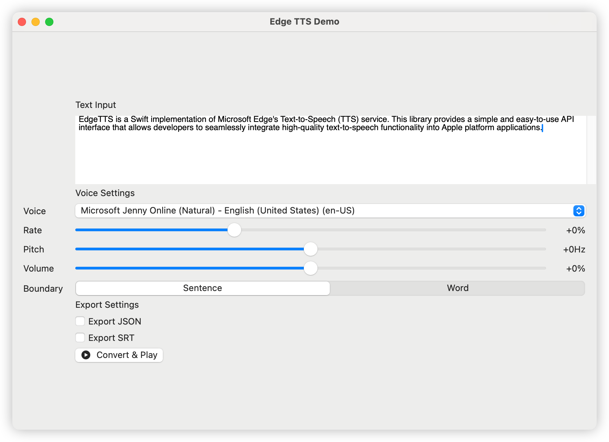

# Edge-TTS

<p align="center">

</p>

Edge-TTS 是一个基于 Microsoft Edge 浏览器文本转语音(TTS)服务的 Swift 实现。该库提供了简单易用的 API 接口，让开发者能够轻松地将高质量的文本转语音功能集成到 Apple 平台应用中。

[English Documentation](README.md) | [日本語ドキュメント](README_JP.md) | [한국어 문서](README_KR.md)

## 功能特点

### 支持多种语音和语言

- 包含超过 400 种神经网络语音
- 支持 100+ 种语言和地区变体
- 自然的语音合成效果

### 灵活的语音控制

- 可调节语速 (-50% - +100%)
- 支持音高调节 (-50Hz - +50Hz)
- 音量控制 (-50% - +50%)
- 边界类型选择（句子/单词）

### 丰富的输出选项

- 支持导出为 MP3 格式
- 实时语音合成流式输出
- 支持异步转换和播放
- 可选的 JSON 元数据导出
- 可选的 SRT 字幕导出
- 跨平台文件导出支持（iOS/macOS）

### 开发工具支持

- 命令行工具便于快速测试和批量处理
- 原生 GUI 应用提供可视化配置界面
- 详细的 API 文档和使用示例

### 全平台兼容

- 支持 macOS 13.0+
- iOS/iPadOS 15.0+

## 安装

### Swift Package Manager

将以下依赖添加到你的 Package.swift 文件中:

```swift
dependencies: [
    .package(url: "https://github.com/brewusinc/edge-tts.git", from: "1.0.0")
]
```

## 快速开始

### 基础用法

```swift
import EdgeTTS

// 创建 TTS 实例
let tts = EdgeTTS(config: Configure(
    voice: "zh-CN-XiaoxiaoNeural",
    rate: "+0%",
    pitch: "+0Hz",
    volume: "+0%",
    saveJSON: true,  // 启用 JSON 元数据导出
    saveSRT: true,   // 启用 SRT 字幕导出
    boundaryType: .sentence  // 使用句子边界（使用 .word 为单词边界）
))

// 异步转换
Task {
    do {
        try await tts.ttsPromise(text: "你好，世界", audioPath: "output.mp3")
        print("转换完成")
    } catch {
        print("转换失败: \(error)")
    }
}
```

### 命令行工具使用

命令行工具提供两个主要命令：`list` 和 `speak`。

#### 列出可用语音

```bash
# 列出所有可用语音
edge-tts-cli list

# 使用代理列出语音
edge-tts-cli list --proxy http://host:port
```

#### 文本转语音

```bash
# 基本用法（直接文本）
edge-tts-cli speak --text "你好，世界" --output hello.mp3

# 从文件读取文本
edge-tts-cli speak --file input.txt --output hello.mp3

# 指定语音和语言
edge-tts-cli speak --text "你好，世界" --voice zh-CN-XiaoxiaoNeural --lang zh-CN --output hello.mp3

# 调整语音参数
edge-tts-cli speak --text "你好，世界" --rate +50% --pitch +10Hz --volume +20% --output hello.mp3

# 启用 JSON 和 SRT 导出
edge-tts-cli speak --text "你好，世界" --save-json --save-srt --output hello.mp3

# 设置边界类型
edge-tts-cli speak --text "你好，世界" --boundary word --output hello.mp3

# 使用代理
edge-tts-cli speak --text "你好，世界" --proxy http://host:port --output hello.mp3
```

`speak` 命令的可用选项：

- `--text`: 要转换的文本
- `--file`: 输入文本文件路径
- `--voice`: 使用的语音（默认：zh-CN-XiaoxiaoNeural）
- `--lang`: 使用的语言（默认：zh-CN）
- `--rate`: 语速（例如：+0%、-10%）
- `--pitch`: 音高（例如：+0Hz、-10Hz）
- `--volume`: 音量（例如：+0%、-10%）
- `--boundary`: 边界类型（sentence 或 word，默认：sentence）
- `--save-json`: 保存时间信息为 JSON
- `--save-srt`: 保存时间信息为 SRT
- `--proxy`: 代理 URL（例如：http://host:port）
- `--output`: 输出文件名（默认：output.mp3）

### GUI 应用使用

1. 下载并安装最新版本的 Edge TTS Demo
2. 打开应用，在文本框中输入要转换的文字
3. 选择所需的语音和参数设置（语速、音高、音量）
4. 根据需要启用 JSON/SRT 导出
5. 选择边界类型（句子或单词）
6. 点击"转换并播放"按钮即可听到合成的语音
7. 使用导出按钮保存文件：
   - 在 iOS 上：使用系统分享表单灵活处理文件
   - 在 macOS 上：使用保存对话框选择保存位置

## 导出功能

### 文件类型

- MP3：合成的语音音频文件
- JSON：每个句子/单词的时间元数据
- SRT：带时间戳的字幕文件

### 平台特定导出功能

- iOS/iPadOS：
  - 系统分享表单集成
  - 分享到其他应用
  - AirDrop 支持
  - 保存到文件应用
- macOS：
  - 原生保存对话框
  - 选择保存位置
  - 文件类型过滤
  - 自动文件扩展名处理

## 常用语音列表

支持的语音列表可以通过以下方式获取：

```swift
let voices = try await tts.fetchVoices()
```

常用中文语音包括：

- zh-CN-XiaoxiaoNeural (女声)
- zh-CN-YunxiNeural (男声)
- zh-CN-XiaoyiNeural (女声)
- zh-TW-HsiaoChenNeural (女声)
- zh-TW-YunJheNeural (男声)

## 贡献指

我们欢迎所有形式的贡献，包括但不限于：

- 报告问题和建议
- 提交代码改进
- 完善文档
- 添加测试用例

## 许可证

本项目采用 MIT 许可证 - 查看 [LICENSE.txt](LICENSE.txt) 文件了解详情。
